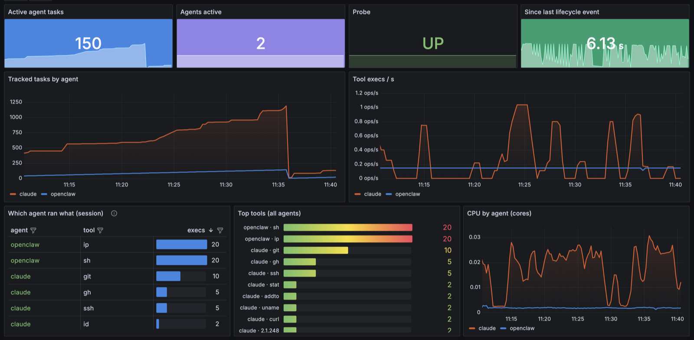
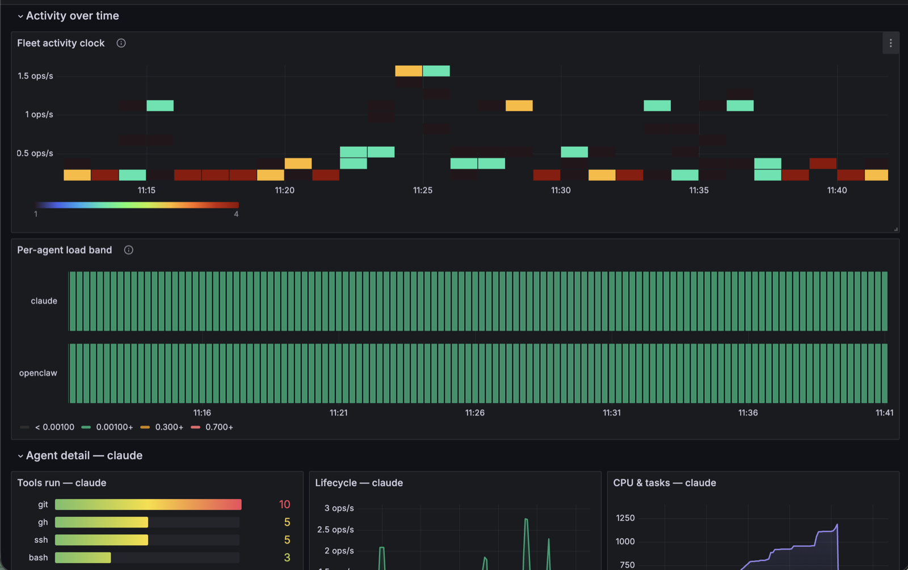

<!-- yeet:user-friendly-title: Watch what your AI agents do -->
# agentcap

<p align="center">
  
  
  <a href="https://discord.gg/JxVseaAVAU"></a>
</p>

A Prometheus exporter for **AI-agent activity** — OpenClaw, Claude Code,
Codex, Gemini, aider, omp, pi, grok, opencode, or any set you configure —
captured in-kernel with eBPF and served by a [yeet](https://yeet.cx)
service. A provisioned Grafana dashboard rides along.



```
 kernel (eBPF)                yeet service "agentcap"              observability
┌────────────────────┐   ┌──────────────────────────────────┐   ┌──────────────┐
│ tracepoints (sched)│   │ collector.js  (shared worker)    │   │ Prometheus   │
│ lsm/socket_*       ├──▶│  BPF maps → Telemetry registry   │◀──┤  :9464/metrics
│ fexit/vfs_*,recvmsg│   │ main.js       keeps it alive     │   │ Grafana      │
│  — zero kprobes    │   │ scrape.js     per-request render │   │  :3000       │
└────────────────────┘   └──────────────────────────────────┘   └──────────────┘
```

## Quickstart

```sh
curl -fsSL https://yeet.cx | sh          # 1. install yeet (CLI + yeetd daemon)
yeet login                               # 2. authenticate this host
git clone https://github.com/yeet-src/agentcap && cd agentcap
make up                                  # 3. build + start the exporter on :9464
make wire                                # 4. print how to add it to your Grafana
```

`make up` runs the exporter (a Prometheus endpoint at `127.0.0.1:9464`);
`make wire` prints the scrape-config + dashboard-import steps for your Grafana.
No Grafana handy? Run `make demo` for a throwaway Prometheus + Grafana in
Docker at <http://localhost:3000/d/agentcap/agent-activity>. Full detail in
**[Setup](#setup)**; `make down` stops everything.

## Agents included

Tracked out of the box (edit [`src/agents.txt`](src/agents.txt) to change the
list — one comm prefix per line):

| | | | |
|---|---|---|---|
| OpenClaw (`openclaw`) | Claude Code (`claude`) | OpenAI Codex (`codex`) | Gemini CLI (`gemini`) |
| aider (`aider`) | opencode (`opencode`) | Block goose (`goose`) | Cline (`cline`) |
| Continue (`continue`) | Cursor (`cursor`) | qwen-code (`qwen`) | Charm crush (`crush`) |
| Sourcegraph amp (`amp`) | grok (`grok`) | omp (`omp`) | pi (`pi`) |

Each name is a **process-comm prefix**; a match pulls in that process's whole
tree, so the `bash` / `node` / `curl` an agent spawns is counted under it. Only
agents actually running appear in the metrics — the list is the watch set, not
a requirement that all be present.

## How it watches agents

The BPF side (`src/bpf/agentcap.bpf.c`) is **policy-free**: the collector
reads the prefix list from `src/agents.txt` and pushes it into a kernel
**LPM trie** at startup, so matching is a single loop-free trie lookup with
no per-agent cost. The word-boundary rule is encoded in the data — each prefix
is inserted as `name\0` / `name-` / `name_` / `name.` — so "pi" catches
`pi`, not `pipewire`. A task is tracked when its comm matches the trie or
when a tracked task forks it — each tree keeps the
identity of the prefix that rooted it, so a `bash` exec'd by openclaw is
counted as `agent="openclaw"`. Roots that predate the probe (a running
gateway) are adopted on their first context switch, fork, or socket/file op.

**Attach types: tracepoints, LSM hooks, and fexit trampolines — no
kprobes.** LSM (`socket_connect`, `socket_sendmsg`) carries exact
before-the-fact semantics and is a stable security API; fexit supplies what
LSM never sees: actual received bytes (`sock_recvmsg`) and actual file I/O
(`vfs_read`/`vfs_write`). The LSM programs need a kernel with BPF-LSM
available, which modern distros ship; if it isn't, the probe reports
`agentcap_probe_up 0` and the app stays up rather than crashing.

Egress is split by rate: rare lifecycle events (fork/exec/exit, with names)
stream over a ring buffer; high-rate sums (CPU ns, socket and file bytes)
live in a `{agent, slot}`-keyed hash the collector polls once a second.

### Audit: domains and destination ports

For security review, the probe also streams, per agent, the **destination
port** of every inet connect and the **domain** of every name lookup it can
see. To keep the kernel side verifier-safe, the probe only filters and
copies raw bytes; the collector parses them in JavaScript, where loops are
free. Two lookup paths are covered:

- **Port-53 DNS** — direct resolver traffic (c-ares, aiodns, `dig`): the
  DNS packet head is shipped and the qname decoded from label format.
- **nss-resolved varlink** — glibc `getaddrinfo` on systemd hosts resolves
  over a unix socket, never touching port 53. The probe recognizes the
  varlink `ResolveHostname` JSON on tracked tasks' unix sends and lifts the
  name.

**DoH/DoT are invisible** — an agent resolving over its own HTTPS/TLS
channel shows only as a `:443` connect, not a domain. That's a real limit
of watching from the kernel, documented rather than papered over.

## Metrics

All labeled `agent`; execs also carry `comm` (the tool that ran, capped at
50 distinct values per agent, then folded into `other`).

| Metric | Type | Meaning |
|---|---|---|
| `agentcap_tasks` | gauge | tracked tasks alive per agent tree |
| `agentcap_execs_total` | counter | binaries exec'd (tools the agent ran) |
| `agentcap_forks_total` / `agentcap_exits_total` | counter | process churn |
| `agentcap_cpu_seconds_total` | counter | on-CPU time of the tree |
| `agentcap_net_connects_total` | counter | inet socket connects |
| `agentcap_net_transmit_bytes_total` / `..._receive_bytes_total` | counter | inet socket traffic (unix sockets excluded) |
| `agentcap_file_read_bytes_total` / `..._write_bytes_total` | counter | actual VFS bytes |
| `agentcap_net_connections_total` | counter | inet connects by destination `port` — the audit view |
| `agentcap_dns_queries_total` | counter | lookups by `domain` (see DNS note below) |
| `agentcap_last_activity_timestamp_seconds` | gauge | unix time of last lifecycle event |
| `agentcap_probe_up` | gauge | BPF object loaded and attached |
| `agentcap_events_dropped_total` | counter | ring-buffer backpressure |

`yeet_worker_up` is prepended by the renderer: 0 means the scrape route is
alive but the collector worker is not.

## Setup

It works out of the box: the common agents — OpenClaw, Claude Code, Codex,
Gemini, aider, opencode, goose, cline, continue, cursor, qwen, crush, amp,
grok, omp, pi — are pre-filled in [`src/agents.txt`](src/agents.txt), one
comm prefix per line. Edit that file to change what's watched.

### 1. Install yeet and log in

```sh
curl -fsSL https://yeet.cx | sh    # installs the yeet CLI + the yeetd daemon
yeet login                         # authenticate this host
yeet status                        # must print "Status: Ok."
```

`yeetd` is the daemon the installer sets up; it does the eBPF loading and runs
the service. Verify your environment anytime with `make check`.

### 2. Run the exporter

```sh
make up            # build + start the exporter on 127.0.0.1:9464 (no Docker)
```

That's the whole product — a Prometheus endpoint at
<http://127.0.0.1:9464/metrics> (`make metrics` to eyeball it). `make up` is
also how you pick up edits to `src/` (it re-imports; the daemon copies unit
scripts at import time). Stop it with `make down`.

### 3. Point Grafana at it

```sh
make wire          # prints the two steps below with absolute paths
```

1. Add a scrape job to your Prometheus (`targets: ["127.0.0.1:9464"]`).
2. Import `deploy/grafana/dashboards/agent-activity.json` into Grafana and
   pick your Prometheus datasource.

Full detail in [Already running Grafana / Prometheus?](#already-running-grafana--prometheus).

> **No Grafana handy?** `make demo` spins up a throwaway Prometheus + Grafana
> in Docker with the dashboard pre-loaded — dashboard at
> <http://localhost:3000/d/agentcap/agent-activity>. It just runs the exporter
> then the container stack; `make down` tears it back down. Docker is only
> needed for this. (Python 3 only if you edit the dashboard generator; the
> generated JSON is committed.)

The service (`service.toml`) is three units: **keeper** (eager) holds the
collector shared worker — and the BPF probe and metric registry inside it —
alive; **scrape** (lazy, per-connection) renders one exposition document per
request over the console portal; **web** binds `127.0.0.1:9464` and mounts
`/metrics`.

### Changing the agent set

Edit [`src/agents.txt`](src/agents.txt) — one comm prefix per line, `#`
comments and blank lines ignored — then `make up`. Or override for one
run without editing anything:

```sh
make dev AGENTS=openclaw,claude,mybot   # standalone, live dump, no HTTP
```

## Make targets

| Target | What it does |
|---|---|
| `make up` | Build the probe and start the exporter on `127.0.0.1:9464` (no Docker). Alias: `make exporter`. Re-run to pick up `src/` edits. |
| `make wire` | Print how to add the exporter to your own Grafana/Prometheus (scrape job + dashboard-import path). |
| `make demo` | Optional: run the exporter **plus** a throwaway Prometheus + Grafana in Docker, dashboard pre-loaded. |
| `make down` | Stop everything — the demo stack (if up) and the exporter service. |
| `make check` | Preflight: verify the yeet CLI, daemon, login, and Docker. |
| `make metrics` | `curl` the `/metrics` endpoint so you can eyeball the exposition. |
| `make status` | Show the running yeet service (`yeet service tree`). |
| `make dev` | Run the collector standalone — live registry dump, no HTTP. `AGENTS=a,b,c` overrides the watch set. |
| `make` | Compile the BPF object only (`bin/probe.bpf.o`). |
| `make veristat` | Load the object with veristat to check the verifier accepts it on this kernel (needs `sudo`). |
| `make dashboard` | Regenerate `deploy/grafana/dashboards/agent-activity.json` from the Python generator. |
| `make clean` | Remove build artifacts. |

Lower-level pieces `make up`/`demo` build on: `make deploy` (import + start the
service), `make obs-up` / `make obs-down` (just the Docker stack), and
`make start` / `stop` / `restart` / `remove` (service lifecycle).

## Prometheus + Grafana

`make obs-up` runs `deploy/docker-compose.yml` (Prometheus on **:9091** —
9090 is often Cockpit's — and Grafana on **:3000**).

Both run with host networking so Prometheus can reach the loopback-only
exporter. The **Agent Activity** dashboard (`deploy/grafana/dashboards/`)
is provisioned automatically and filterable by agent, with a stable color
per agent across every panel. It has four sections:

- **Overview** — hero stats, tracked tasks, tool-exec rates, a "which agent
  ran what" table, top tools, CPU / network / file-I/O / churn timeseries.
- **Audit — who talked to what** — per-agent domain and destination-port
  tables (ports classified and color-coded: HTTPS/DNS green, SSH/SMTP
  amber, telnet/RDP red, unknown neutral), plus DNS and connection rates.
- **Activity mix** — CPU-share and egress-share donuts, a tool-launch bar
  chart, an active/idle **state-timeline** across agents, and per-agent CPU
  gauges — varied forms for a fast read.
- **Agent detail — $agent** — a repeated, collapsed row per selected agent
  with its own tools, lifecycle, CPU/tasks, network, domains and ports.



The dashboard is generated by `deploy/grafana/gen-dashboard.py` (edit the
Python, rerun it, Grafana's file provider reloads within 30s) so the panel
boilerplate and the per-agent color mapping stay consistent.

### Already running Grafana / Prometheus?

Skip the bundled stack — run only the exporter and wire it into what you
have. No Docker required:

```sh
make up            # just the exporter on 127.0.0.1:9464 (no docker)
make wire          # prints the two steps below, with absolute paths
```

1. **Prometheus** — add a scrape job (the exporter listens on loopback, so
   Prometheus must reach `127.0.0.1`; if it runs elsewhere, expose the port
   or scrape from the same host):

   ```yaml
   scrape_configs:
     - job_name: agentcap
       static_configs:
         - targets: ["127.0.0.1:9464"]
   ```

2. **Grafana** — make sure a Prometheus datasource exists, then import
   `deploy/grafana/dashboards/agent-activity.json` (Dashboards → New →
   Import). The dashboard references a datasource by uid `prometheus`; if
   yours differs, the import screen lets you pick it, or set a `DS_PROMETHEUS`
   default. Nothing else is needed — no docker, no provisioning files.

To refresh the dashboard later, re-import the same JSON (regenerate it first
with `make dashboard` if you've edited the generator).

## CI

- `.github/workflows/ci.yml` — BPF object builds, JS syntax, `service.toml`
  parses, `promtool check config`, dashboard JSON lint, compose config.
- `.github/workflows/kernel-matrix.yml` — boots 6.1 / 6.6 / 6.12 / bpf-next
  in VMs and runs veristat against `bin/probe.bpf.o`; a rejection on an old
  kernel is the signal of the minimum supported kernel (LSM + fexit programs
  need BTF and `CONFIG_BPF_LSM`). Same check locally: `make veristat-matrix`.

## Layout

```
src/bpf/agentcap.bpf.c   the probe: sched tracepoints + LSM + fexit
src/agents.txt           the tracked agent list (one comm prefix per line)
src/agents.js            parses agents.txt into the prefix array
src/collector.js         shared worker: fills kernel maps, owns the
                         Telemetry registry, polls counters, serve()s scrapes
src/scrape.js            per-request /metrics renderer (console portal)
src/main.js              eager keeper — holds the worker (and probe) alive
service.toml             yeet service: units, web server, /metrics route
deploy/                  prometheus.yml, docker-compose, grafana provisioning
Makefile                 build + run lifecycle (make up, wire, demo, …)
```

---

Built with [yeet](https://yeet.cx/docs/?utm_source=github&utm_medium=readme&utm_campaign=agentcap),
a JS runtime for writing eBPF programs and live system dashboards on Linux.
Join us on [Discord](https://discord.gg/JxVseaAVAU?utm_source=github&utm_medium=readme&utm_campaign=agentcap).
